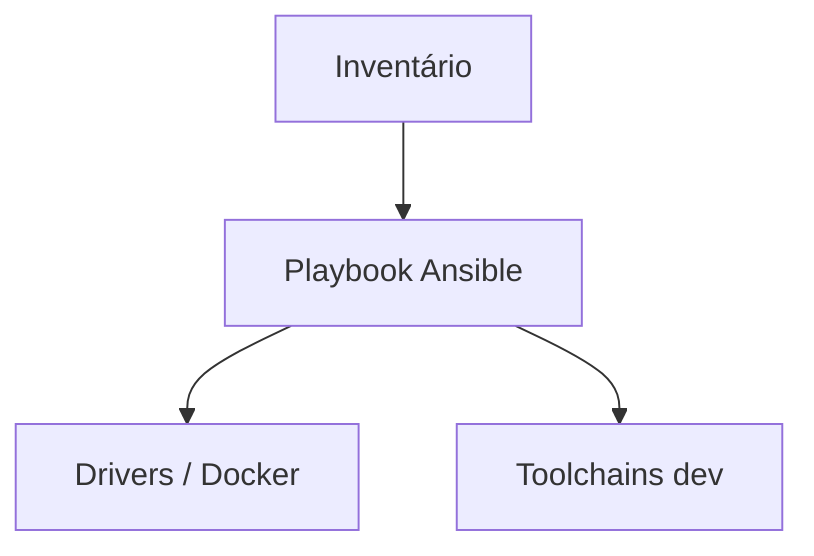

<div align="center">

# Provisionador de estação de trabalho zero-to-hero

**Provisionador de estação de trabalho zero-to-hero**

<p>
  <a href="https://github.com/SrSatriano/zero-to-hero-workstation-provisioner"></a>
</p>

<p>
  
  
  
  
</p>

<p><strong>IaC Ansible para estação de desenvolvimento completa em Linux/WSL2.</strong></p>

<p>
  Autor: <a href="https://github.com/SrSatriano">@SrSatriano</a> ·
  Release <strong>1.0.0</strong> (2026-03-26)
</p>

</div>

---

## Índice

1. [Visão geral](#visão-geral)
2. [Problema e solução](#problema-e-solução)
3. [Para quem é](#para-quem-é)
4. [Casos de uso](#casos-de-uso)
5. [Funcionalidades](#funcionalidades)
6. [Stack tecnológica](#stack-tecnológica)
7. [Arquitetura](#arquitetura)
8. [Estrutura do repositório](#estrutura-do-repositório)
9. [Pré-requisitos](#pré-requisitos)
10. [Instalação e execução](#instalação-e-execução)
11. [Configuração](#configuração)
12. [Testes](#testes)
13. [Performance](#performance)
14. [Deploy e operação](#deploy-e-operação)
15. [Limitações conhecidas](#limitações-conhecidas)
16. [Roadmap](#roadmap)
17. [Documentação complementar](#documentação-complementar)
18. [Segurança e licença](#segurança-e-licença)

---

## Visão geral

Este repositório faz parte do **portfólio de engenharia** mantido por [@SrSatriano](https://github.com/SrSatriano). A versão **1.0.0** entrega implementação do núcleo do produto, testes automatizados, pipeline de integração contínua e documentação operacional em **português brasileiro**.

O objetivo é permitir que você clone, execute e evolua o projeto com clareza — do desenvolvimento local ao deploy em produção.

## Problema e solução

| | |
|---|---|
| **Problema** | Configurar máquina nova para HFT/ML leva dias manuais. |
| **Solução** | Playbook idempotente com roles NVIDIA, Docker, C++, Python e Node. |

## Para quem é

Desenvolvedores que formatam PCs com frequência.

## Casos de uso

- WSL2 dev box
- Servidor de backtest

## Funcionalidades

- [x] Roles modulares
- [x] group_vars customizável
- [x] Compatibilidade WSL2
- [x] Lista de pacotes
- [x] Playbook idempotente

## Stack tecnológica

| Camada | Tecnologias |
|--------|-------------|
| **Principal** | Ansible, Bash |

## Arquitetura



Detalhamento de componentes, fluxos de dados e decisões de design: [docs/ARCHITECTURE.md](docs/ARCHITECTURE.md).

## Estrutura do repositório

| Caminho | Descrição |
|---------|-----------|
| `ansible/playbooks/` | Playbooks |
| `ansible/roles/` | Roles |

## Pré-requisitos

Ansible 2.15+, Ubuntu 22.04 ou WSL2.

## Instalação e execução

```bash
git clone https://github.com/SrSatriano/zero-to-hero-workstation-provisioner.git
cd zero-to-hero-workstation-provisioner
```

```bash
ansible-playbook -i inventory/local.ini ansible/playbooks/workstation.yml
```

## Configuração

_Este projeto não exige variáveis obrigatórias além das credenciais locais em `.env`._

> **Importante:** nunca faça commit de arquivos `.env` com segredos reais. Use `.env.example` como referência.

## Testes

Execute a suíte de testes antes de abrir pull requests:

```bash
ansible-playbook --syntax-check ansible/playbooks/workstation.yml
```

A pipeline [`.github/workflows/ci.yml`](.github/workflows/ci.yml) repete build e testes em cada push para `main`.

## Performance

| Provisionamento completo | ~25 min |

Metodologia, hardware de referência e flags de compilação: [docs/ARCHITECTURE.md](docs/ARCHITECTURE.md).

## Deploy e operação

| Guia | Conteúdo |
|------|----------|
| [docs/DEPLOYMENT.md](docs/DEPLOYMENT.md) | Homologação, produção e rollback |
| [docs/OPERATIONS.md](docs/OPERATIONS.md) | Monitoramento, alertas e incidentes |

## Limitações conhecidas

- Drivers NVIDIA variam por hardware

## Roadmap

- Role para Rust e Foundry

## Documentação complementar

| Documento | Descrição |
|-----------|-----------|
| [docs/ARCHITECTURE.md](docs/ARCHITECTURE.md) | Arquitetura e decisões técnicas |
| [docs/DEPLOYMENT.md](docs/DEPLOYMENT.md) | Deploy passo a passo |
| [docs/OPERATIONS.md](docs/OPERATIONS.md) | Runbook operacional |
| [CONTRIBUTING.md](CONTRIBUTING.md) | Como contribuir |
| [CHANGELOG.md](CHANGELOG.md) | Histórico de versões |
| [SECURITY.md](SECURITY.md) | Política de segurança |
| [AUTHORS.md](AUTHORS.md) | Créditos |

## Segurança e licença

- Dependências revisadas na release **1.0.0**
- Vulnerabilidades: siga [SECURITY.md](SECURITY.md)
- Licença: [MIT](LICENSE) © SrSatriano 2026

---

<p align="center">Desenvolvido com foco em clareza e engenharia de produção · <a href="https://github.com/SrSatriano/zero-to-hero-workstation-provisioner">Ver no GitHub</a></p>
