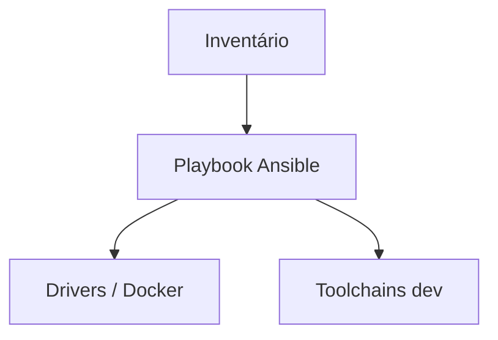

# Arquitetura — Provisionador de estação de trabalho zero-to-hero

> Versão do documento: **1.0.0** · Última revisão: **2026-03-26**

## 1. Visão geral

Playbook idempotente com roles NVIDIA, Docker, C++, Python e Node.

Este documento descreve como os componentes se relacionam, onde há estado, e como escalar ou observar o sistema em produção.

## 2. Diagrama de contexto

## 3. Componentes principais

| Componente | Responsabilidade |
|------------|------------------|
| Roles | Roles modulares |
| group_vars | group_vars customizável |
| Compatibilidade | Compatibilidade WSL2 |
| Lista | Lista de pacotes |
| Playbook | Playbook idempotente |
| Observabilidade | Métricas, logs estruturados e health checks |
| Persistência | Estado durável e idempotência onde aplicável |

## 4. Fluxos críticos

### 4.1 Caminho feliz

1. Cliente ou operador envia requisição/evento.
2. Camada de serviço valida entrada e autentica quando necessário.
3. Núcleo de domínio executa regra de negócio.
4. Resultado é persistido e/ou publicado para assinantes.
5. Métricas e logs registram latência e resultado.

### 4.2 Falhas e degradação

- Timeouts configuráveis em integrações externas.
- Retry com backoff apenas onde a operação é idempotente.
- Modo degradado documentado no README (ex.: sem LLM, sem GPU).

## 5. Decisões de design

| Decisão | Motivação |
|---------|-----------|
| **Baixa latência** | Hot path sem alocações desnecessárias no núcleo |
| **Fail-safe** | Falha parcial não corrompe estado; reconciliação quando possível |
| **Auditabilidade** | Logs estruturados com identificador de correlação |
| **Testabilidade** | Contratos estáveis e testes automatizados na CI |

## 6. Escalabilidade

- Escale horizontalmente camadas **stateless** (API, workers).
- Particione estado por chave de negócio (símbolo, tenant, shard).
- Use filas para picos assimétricos entre produtor e consumidor.

## 7. Observabilidade

| Sinal | Uso |
|-------|-----|
| Latência p50/p99 | SLO de experiência |
| Taxa de erro | Alertas de regressão |
| Utilização CPU/GPU | Capacity planning |
| Lag de fila | Autoscaling |

## 8. Segurança na arquitetura

- Segredos apenas em variáveis de ambiente ou secret manager.
- Princípio do menor privilégio em tokens de API e RBAC.
- Dados sensíveis: minimize retenção e documente bases legais (LGPD quando aplicável).

## 9. Referências

- [README](../README.md) — visão do produto
- [DEPLOYMENT.md](DEPLOYMENT.md) — ambientes
- [OPERATIONS.md](OPERATIONS.md) — runbook
