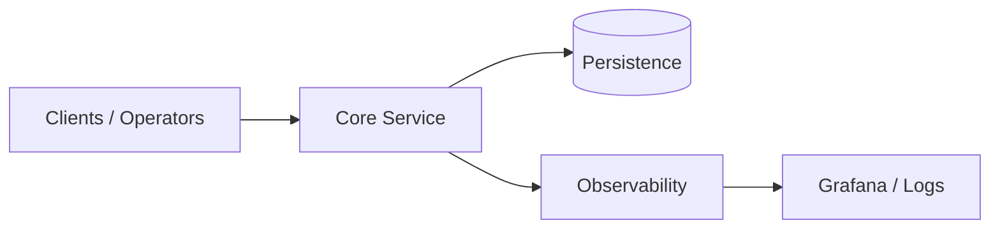

# Architecture

## Visão geral

Este documento descreve a arquitetura em produção da versão **1.0.0**.

## Componentes

| Componente | Responsabilidade |
|------------|------------------|
| Core | Regras de negócio e orquestração |
| Persistence | Estado durável e idempotência |
| Observability | Métricas, traces e alertas |

## Decisões de design

- **Baixa latência**: hot path sem alocação desnecessária
- **Fail-safe**: degradação graceful e reconciliação
- **Auditável**: logs estruturados e rastreio de requisições

## Escalabilidade

Escala horizontal no tier stateless; particionamento onde há estado (símbolos, tenants, shards).
